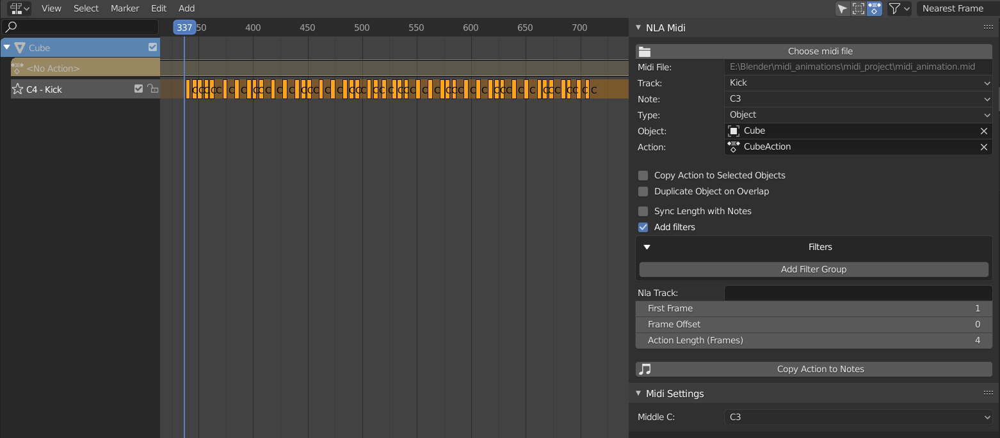
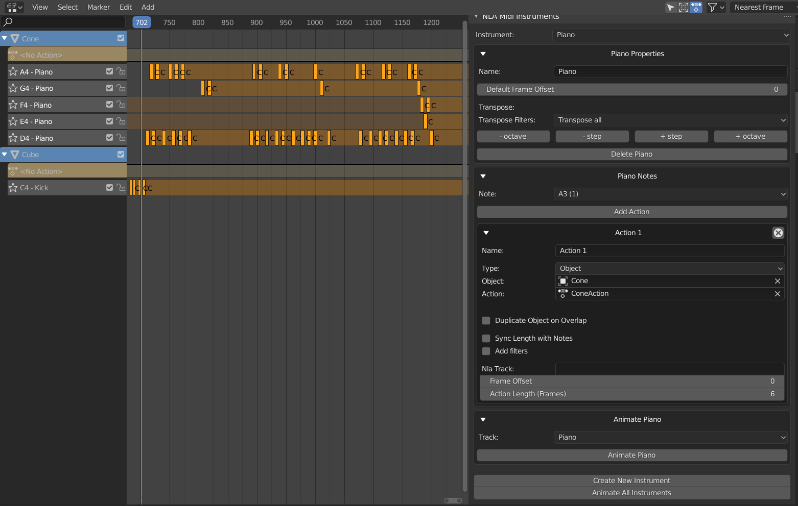

# Blender NLA Midi Copier
Blender add-on for creating midi-driven animations from the Nonlinear Animation view.  Adds a panel to the Nonlinear Animation view that allows for copying an action to each instance of a note in a midi file. For example, actions strips for a selected action could be generated to line up with all of the C4 notes played by a piano. To access the panel, expand the right-side panel in the Nonlinear Action View and select the Midi tab.

An instrument can be defined as a collection of notes and actions.  The instrument is independent of any specific midi file, allowing for defining a set of actions for each note and later syncing them up to a midi file.  To define an instrument, expand the right-side panel in the Nonlinear Action View and select the Midi Instruments tab.

This add-on is being developed for Blender 2.83.

Midi Panel 

 
### Midi Panel controls:

* Choose midi file:
  * Select a midi file.
* Midi File:
  * Displays the selected midi file.
* Track:
  * Choose a track from the midi file. (Tracks with no notes will not be shown.)
* Note:
  * Choose a note from the selected track. (Only notes played in the selected track will be shown.)
* Type:
  * The type of object to animate. Select "Object" to animate objects in the scene. Change this value to animate something other than an object.  For example, select "Light" to animate the brightness of a light.
* Object:
  * The object to animate.  This field will change depending on the value of Type.  If Type is Object, this field will allow selecting an object, if Type is Light, this field will allow selecting a Light, ect.  
* Action:
  * The action to generate NLA Strips from. Only actions valid for the selected Type will be shown.
* Copy Action to Selected Objects:
  * If this option is selected, then the selected objects will be animated instead of the Object in the Object control. This option is only valid for Type Object. 
* Duplicate Object on Overlap:
  * If this option is selected, then overlapping action strips will be placed on new objects that are duplicates of the original object being animated.  If this option is not selected, then overlapping action strips will be omitted. This option is only valid for Type Object.
* Nla Track:
  * The name of the NLA track to place action strips on.  Action strips will be placed on a new track created with this name.  A name wil be automatically generated if this field is blank. 
* First Frame:
  * The frame that the midi file starts on.
* Frame Offset:
  * Offset in frames to use when generating action strips (can be negative). For example, if the frame offset is -5, then the generated action strips will be placed starting 5 frames before the instances of the selected note.
* Action Length (Frames):
  * The length of the action. Used to determine if the action overlaps another generation action. Defaults to the true length of the action. As an example, if this is set to 50 frames, and two notes are only 30 frames apart, then the action for the second note will be considered to overlap the action for the first note.  The second note's action will either be omitted or copied to a duplicate object, depending on whether Duplicate Object on Overlap is selected. If this value is set to less than the true length of the action, it will be replaced by the true length of the action. This control is not available if no action is selected.
* Copy Action to Notes:
  * Click this button to generate action scripts from the selected action that line up with all instances of the selected note.

  

Midi Instrument Panel 

 
### Midi Instrument Panel Controls

* Instrument
  * The selected instrument.  

#### Properties Box

* Name
  * The name of the instrument.
* Default Frame Offset:
  * The default frame offset used when creating a new action for the instrument.
* Transpose
  * \- octave: shift all actions down an octave
  * \- step: shift all actions down a step
  * \+ step: shift all actions up a step
  * \+ octave: shift all actions up an octave
* Delete \<instrument name\>  
  * Delete the instrument
      

#### Notes Box

* Note:
  * The selected note.  If there are actions associated to the note, the number of actions will be displayed in parentheses. For example, C5 (2) indicates that there are two actions associated to the note C5.
* Add Action
  * Adds an action for the selected note.  
* Action Boxes
  * Each action for the selected note is displayed in its own box. See the "Midi Panel Controls" section above for explanations of the controls in the action boxes.   

#### Animate Box

The animate instrument box is not avalable if there is no selected midi file.  Select a midi file in the Midi Panel.

* Track
  * The track from the midi file to use when animating the instrument.
* Animate \<instrument name\>
  * Animate the instrument.  The instrument's actions will be copied to notes from the selected track from the selected midi file.  The midi file is selected in the Midi Panel, and the selected track is selected in the Track field directly above this button.  The First Frame field in the Midi Panel will be used as the frame the midi file starts on.

* Create New Instrument
  * Creates a new instrument.
  

  

### Installation:
* Installation is the normal installation process for multi-file add-ons.
  * Option 1: Download as a zip file. In Blender, go to Edit > Preferences > Add-ons, and click Install.  Select the zip file and click Install Add-on from File.
  * Option 2: Clone into the 2.83/scripts/addons directory in the Blender installation.
* To enable the add-on, in Blender, go to Edit > Preferences > Add-ons, and select Animation in the drop-down. Select Community at the top if it isn't already selected. Check the box next to the add-on to enable it.
