# Blender NLA Midi Copier

Blender add-on for creating midi-driven animations from the Nonlinear Animation view. Adds a panel to the Nonlinear
Animation view that allows for copying an action to each instance of a note in a midi file. For example, actions strips
for a selected action could be generated to line up with all the C4 notes played by a piano. To access the panel, expand
the right-side panel in the Nonlinear Action View and select the Midi tab.

This add-on is written for Blender 3.5 and is compatible back to Blender 2.80.
Add-on Version 0.16.1. [Changelog here](CHANGELOG.md). 

Midi Panel 

### Midi Panel controls:

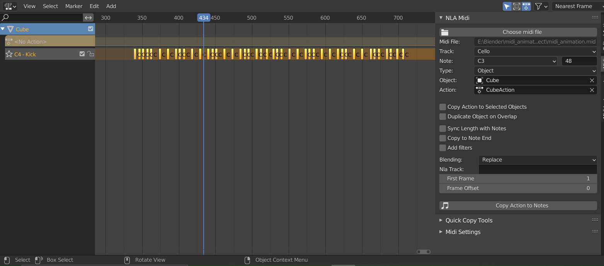

* Choose midi file:
    * Select a midi file.
* Midi File:
    * Displays the selected midi file.
* Track:
    * Choose a track from the midi file. (Tracks with no notes will not be shown.)
* Note:
    * Choose a note from the selected track. (Only notes played in the selected track will be shown.) A note can also be
      selected by typing a note name or midi note number in the box next to the drop-down.
* Type:
    * The type of object to animate. Select "Object" to animate objects in the scene. Change this value to animate
      something other than an object. For example, select "Light" to animate the brightness of a light.
* Object:
    * The object to animate. This field will change depending on the value of Type. If Type is Object, this field will
      allow selecting an object, if Type is Light, this field will allow selecting a Light, ect.
* Action:
    * The action to generate NLA Strips from. Only actions valid for the selected Type will be shown.
* Copy Action to Selected Objects:
    * If this option is selected, then the selected objects will be animated instead of the Object in the Object
      control. This option is only valid for Type Object, Type Material, or any type that can be object data (such as
      Mesh and Curve). If the type is Material, the action wll be copied to the active materials of the selected
      objects.
* Sync Length with Notes
    * If selected, the length of the copied action will be scaled to match the length of the note it is copied to
      multiplied by the scale factor.
    * Action Timing
        * Scale Action Length
          * Stretch or compress the action to fit the scaled NLA strip.
        * Repeat
          * Repeat the action to fill the scaled NLA strip. Truncates the action if the action is longer than the NLA strip.
    * Scale Factor
        * Affects the length of actions when "Sync Length with Notes" is selected. The copied action length will be equal to
          the length of the note multiplied by this scale factor. (Scale factor of 1 will match the note length exactly.)
* Copy to Note End
    * Copies the action to the end of the note instead of the beginning.
* Add filters:
    * Adds filters. If selected, any defined filters will be applied when copying actions. No filters will be applied if
      this option is not selected. See the Filters section for more information about filters.
* Overlap
    * Options for how to handle overlapping action strips.
    * Skip
        * Skip overlapping actions.
    * Blend
        * Place overlapping actions on a new track above the existing action.
    * Duplicate Object
        * Place overlapping action strips on new objects that are duplicates of the original object being animated. This
          option is only valid for Type Object or any type that can be object data (such as Mesh and Curve). If the type
          is not Object, then all objects using the data will be duplicated. For example if the action is defined on a
          Curve, all objects using the Curve will be duplicated.
* Blending
    * Sets blending type for action strips placed on additional nla tracks if the first nla track does not have room for
      the action. Only used when Overlap is set to Blend.
* Action Length (Frames):
    * The length of the action. Used to determine if the action overlaps another action when duplicating objects.
      Defaults to the true length of the action. As an example, if this is set to 50 frames, and two notes are only 30
      frames apart, then the action for the second note will be considered to overlap the action. The second note's
      action will be copied to a duplicate object if Duplicate Object on Overlap is selected. If this value is set to
      less than the true length of the action, it will be replaced by the true length of the action. Only used when
      Overlap is set to Duplicate Object.
* Nla Track:
    * The name of the NLA track to place action strips on. If a track with this name exists, actions will be placed on
      it, otherwise a new track with this name will be created. A name wil be automatically generated if this field is
      blank.
* First Frame:
    * The frame that the midi file starts on.
* Frame Offset:
    * Offset in frames to use when generating action strips (can be negative). For example, if the frame offset is -5,
      then the generated action strips will be placed starting 5 frames before the instances of the selected note.
* Copy Action to Notes:
    * Generates action strips from the selected action that line up with all instances of the selected note.

  

Midi Instrument Panel 

An instrument can be defined as a collection of notes and actions. The instrument is independent of any specific midi
file, allowing for defining a set of actions for each note and later syncing them up to a midi file. To define an
instrument, expand the right-side panel in the Nonlinear Action View and select the Midi Instruments tab.

### Midi Instrument Panel Controls

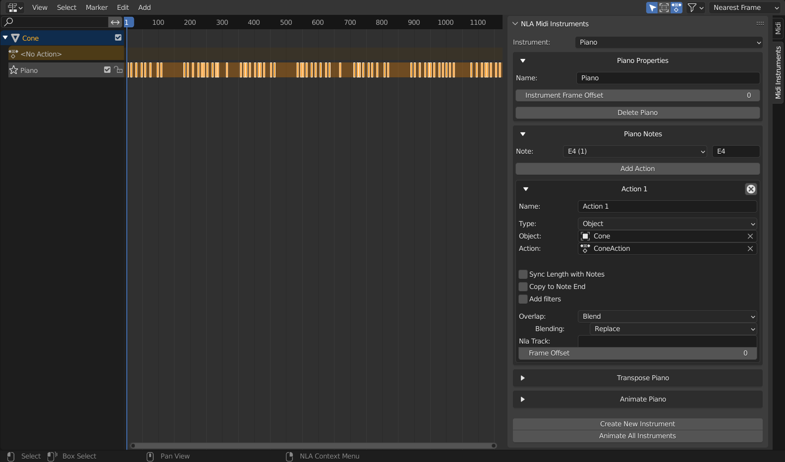

* Instrument
    * The selected instrument.

#### Properties Box

* Name
    * The name of the instrument.
* Instrument Frame Offset:
    * The frame offset used when animating the instrument. This is added to the frame offset for each action.
* Delete \<instrument name\>
    * Delete the instrument

#### Notes Box

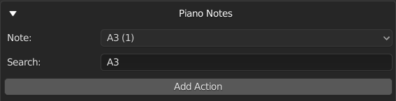

* Note:
    * The selected note. If there are actions associated to the note, the number of actions will be displayed in
      parentheses. For example, C5 (2) indicates that there are two actions associated to the note C5. An astrix
      indicates than there are actions that may be copied to other notes due to pitch filters. An exclamation mark
      indicates there are actions that are missing an object or action, so they will not be copied.
* Add Action
    * Adds an action for the selected note.
* Action Boxes
    * Each action for the selected note is displayed in its own box. See the "Midi Panel Controls" section above for
      explanations of the controls in the action boxes.

#### Transpose Box

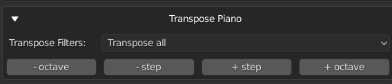

* Transpose: The transpose buttons transpose the instrument. Transpose buttons are disabled if the transposition would
  result in notes outside the 0-127 midi pitch range.
    * \- octave: shift all actions down an octave
    * \- step: shift all actions down a step
    * \+ step: shift all actions up a step
    * \+ octave: shift all actions up an octave
* Transpose filters: Sets how the pitch filters are transposed
    * Do not transpose: Does not transpose the pitch filters.
    * Transpose if possible except all-inclusive: Transposes all pitch filters except pitch filters that include every
      midi pitch (pitch >= 0 or pitch <= 127). Pitch filters that would be transposed to a pitch outside the 0-127 midi
      pitch range are not transposed.
    * Transpose if possible: Transposes pitch filters. Pitch filters that would be transposed to a pitch outside the
      0-127 midi pitch range are not transposed.
    * Transpose all except all-inclusive: Transposes all pitch filters except pitch filters that include every midi
      pitch (pitch >= 0 or pitch <= 127). Transpose buttons are disabled if any pitch filters would be transposed to a
      range outside the 0-127 midi pitch range.
    * Transpose all: Transposes all pitch filters. Transpose buttons are disabled if any pitch filters would be
      transposed to a range outside the 0-127 midi pitch range.

#### Animate Box

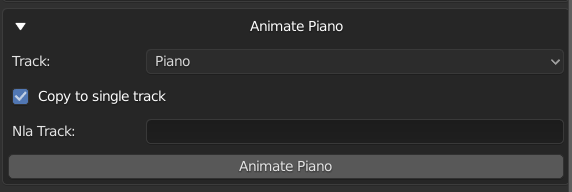

The animate instrument box is not available if there is no selected midi file. Select a midi file in the Midi Panel.

* Track
    * The track from the midi file to use when animating the instrument.
* Copy to single track
    * If selected, all actions for the instrument will be copied to a single NLA track (this is overwritten for any
      actions within that define their own NLA track). If this is not selected, a new track will be created for each
      note.
* Nla Track:
    * The name of the NLA track to copy actions to if "Copy to single track" is selected. A name will be generated if
      this field is blank.
* Animate \<instrument name\>
    * Animate the instrument. The instrument's actions will be copied to notes from the selected track from the selected
      midi file. The midi file is selected in the Midi Panel, and the selected track is selected in the Track field
      directly above this button. The First Frame field in the Midi Panel will be used as the frame the midi file starts
      on.

* Create New Instrument
    * Creates a new instrument.

  

Filters

### Filters

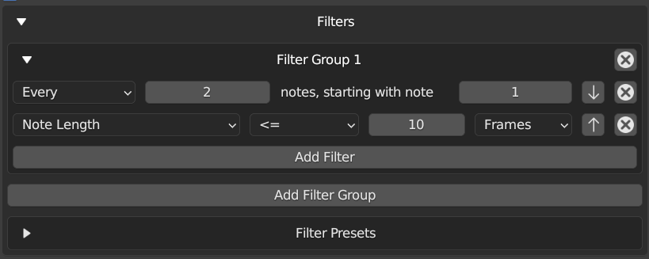

Filters can be used to filter notes when copying actions. Filters are defined within a filter group. Actions are copied
to notes that match any of the filter groups. For a note to match a filter group, it must match all filters within the
group. For example, if group 1 has filters A and B, and group 2 has filters C and D, actions will be copied to notes
that match either both filters A and B, or both filters C and D (this includes actions matching all filters A, B, C, and
D).

### Filter Controls

Click "Add Filter Group" to add a new filter group. Click the x in the top right of the filter group to remove it.

Click "Add Filter" to add a filter within the group. Click the x next to the filter to remove it.

If more than one filter is defined in a group, the arrows can be used to move the filters up and down. The filters are
applied from top to bottom.

Pitch filters overwrite instrument notes and the note selected in the midi panel.

### Filters

* Every
    * Includes every nth note starting with a specified index. For example, "Every 2 notes, starting with note 1" will
      include every other note, starting with the first note.
* Note Length
    * Filters notes by length. For example, "Note Length < 10 frames" will include only notes that have a length less
      than 10 frames.
* Relative Start Time
    * Filters notes by their start time (time is based on the beginning of the midi file). For example, "Relative Start
      Time > 5 Seconds" will include only notes that start after 5 seconds into the midi file.
* Pitch
    * Filters notes by pitch. For example, "Pitch > B3" will include all pitches above B3 (so C3 and higher). If a pitch
      filter is present, it will overwrite the note selected in the midi panel or in the instrument (only affects the
      filter group the filter is defined in). If the pitch is "Selected" it will match the selected pitch in the midi
      panel, or the pitch of the instrument note if the filter is part of an instrument.
* Velocity
    * Filters notes by their midi velocity. For example, "Velocity = 127" will include only notes with a velocity of
        127.

Quick Copy Tools

### Quick Copy Tools

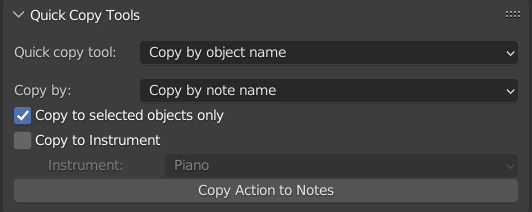

The Quick Copy Tools panel contains tools for copying to multiple notes at once when different objects are animated to
different notes. The action defined in the NLA Midi panel can be copied to multiple objects, with a different note for
each object, by ordering the selected objects along a path. The action can also be copied to an instrument (with or
without copying along a path).

### Copy by object name

The Copy by object name tool copies actions to objects based on the name of the object. It matches notes based on the 
Copy by option.

* Copy by
  * Copy by note name
    * Copy to objects with names that either start or end with the note. For example, if one of the selected objects is 
      A3_Cube or Cube_A3, the action will be copied to that object for all A3 notes.
  * Copy by track and note name
    * Copy to objects with names that either start or end with the note and also contain the name of the track selected 
      in the NLA midi panel.
* Copy to selected objects only
  * If selected, only copy actions to selected objects, otherwise copy to any matching objects in the scene. 
* Copy to Instrument
    * If selected, copies the action selected instrument instead of generating action strips for the note.
* Instrument
    * The instrument to copy the action to.

#### Copy to Instrument

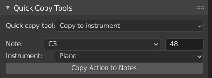  
The copy to instrument tool copies the action in the NLA midi panel to the selected instrument and note.

* Note
    * The note to copy the action to. (This field is automatically updated when the note selected in the NLA midi panel
      is changed.) This property is not used when Copy along path is selected.
* Instrument
    * The instrument to copy the action to.

#### Copy Along Path

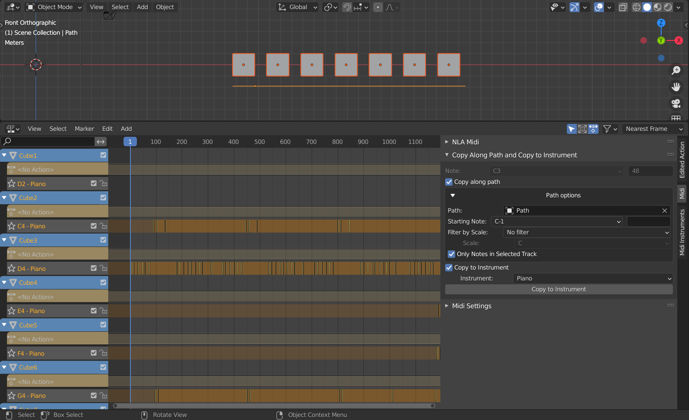
Copy along path is a tool that can be used to quickly copy actions to multiple objects, with a different note for each
object, if every object uses the same action. This is useful for animating something like a piano without having to
animate each key individually. The piano's keys can all be animated at once by creating a path to define the ordering of
the keys (starting at the lowest pitch and ending at the highest), and using the Copy along path option.

* Copy along path
    * If selected, then all selected objects are animated, each to a different note. This option is only valid for Type
      Object, Type Material, or any type that can be object data (such as Mesh and Curve). If the type is Material, the
      action wll be copied to the active materials of the selected objects.
* Path
    * A path defining the ordering of the selected objects. Any Curve can be used as the path. The path itself will not
      be included as one of the animated objects, even if it is selected.  
      Only the points along the path are used in the calculation for ordering the objects. This means that curved paths
      may produce unexpected results, since the calculation uses straight lines between each point on the path.
      Generally, for paths that are not straight, the more points on the path, the more accurate the result.
    * Starting Note
        * The note that the first object along the path will be animated to, if the note is not filtered out. If the
          note is filtered out, the first object will be animated to the first note that is not filtered out and has a
          pitch greater than this note.
    * Filter by scale
        * Options for filtering notes by a major scale.
        * No filter
            * Does not filter notes by a scale.
        * In scale
            * Only include notes in the selected scale.
        * Not in scale
            * Only include notes that are not in the selected scale.
    * Scale
        * The scale to filter by. This is a major scale, so for example a selection of "C" filters using notes in the C
          major scale.
    * Only Notes in Selected Track
        * Only include notes in the selected midi track in the NLA Midi panel.
* Copy to Instrument
    * If selected, copies the action selected instrument instead of generating action strips for the note.
* Instrument
    * The instrument to copy the action to.

Midi Settings

### Midi Settings

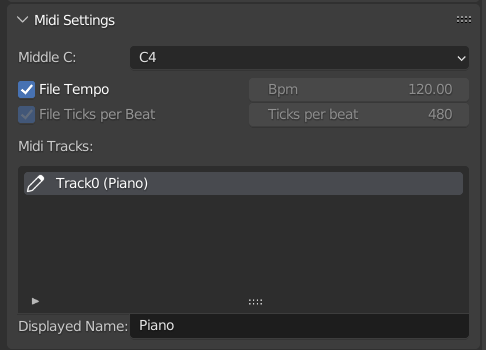

* Middle C
    * Sets the note that corresponds to middle C (midi pitch 60). This changes the displayed value of middle C and
      updates the display for instrument notes and the note in the midi panel. This does not change the midi note
      pitches.
* File Tempo
    * If selected, the tempo from the midi file is used to calculate note times. If not selected, the bpm setting is
      used. Tempo changes in the midi file are ignored if this is not selected.
* Bpm
    * The beats per minute. If "File Tempo" is selected, this shows the midi file's bpm.
* File Ticks per Beat
    * If this or "File Tempo" is selected, the ticks per beat from the midi file is used to calculate note times. If not
      selected, the Ticks per beat setting is used. For most tempo changes, leaving this option selected should be
      sufficient.
* Ticks per beat
    * The ticks per beat. If "File Ticks per Beat" is selected, this shows the midi file's ticks per beat.
      (Midi files count time in ticks. Most midi files divide minutes into beats, and beats into ticks. Some midi files
      may be in frames per second (and ticks per frame) instead of beats per minute. For these files, the file bpm will
      be shown as 60, and the file ticks per beat will show the number of ticks per second.)
* Midi Tracks
  * Lists the tracks in the midi file. The name displayed for a track in track selection drop-downs can be changed 
    using the Displayed Name field.  

Graph Editor Keyframe Generation

### Graph Editor Keyframe Generation

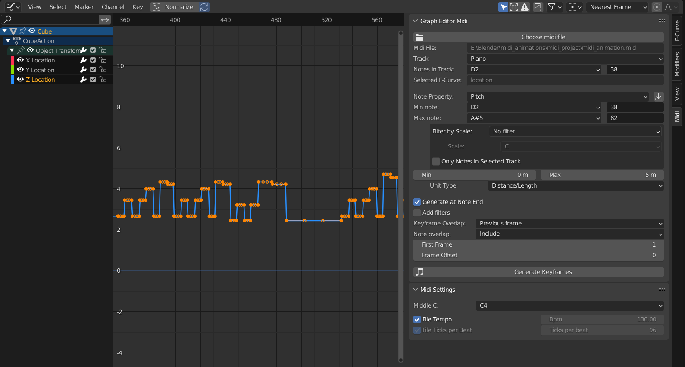

Keyframes can be generated based on pitch in the graph editor. Select an F-Curve in the graph editor, choose a low and
high pitch, choose a min and max keyframe value, and generate keyframes with values based on the pitch.

* Midi File:
    * Displays the selected midi file.
* Track:
    * Choose a track from the midi file. (Tracks with no notes will not be shown.)
* Notes in Track:
    * Drop-down that displays the notes in the selected track. This property does not affect keyframe generation if Note
      Property is set to Pitch. If the Note Property is not Pitch, then keyframes will only be copied to the selected
      Note (unless there are pitch filters).
* Selected F-Curve
    * Displays the data path of the selected F-Curve in the graph editor. This is the F-Curve keyframes will be
      generated on.
* Note Property / CC Data
  * Generate keyframes based on either note properties or continuous controller data
* Note Property:
    * The note property to use for keyframe generation.
    * Pitch
        * Generate keyframes based on note pitch
    * Length (frames)
        * Generate keyframes based on note length in frames
    * Velocity
        * Generate keyframes based on note velocity
* CC Type:
    * The CC Controller to generate keyframes from
* Load min and max keyframe values:
    * Sets the Min and Max notes or Map to min and Map to max values to the minimum and maximum values found in the
      selected midi track. (This is the button next to note property.)
* Min note:
    * The lowest note (inclusive) that will be used for keyframe generation. Only used if Note Property is set to Pitch.
* Max note:
    * The highest note (inclusive) that will be used for keyframe generation. If this is lower than the min note,
      keyframes will be generated starting at the min note down to this note. Only used if Note Property is set to
      Pitch.
* Map to min:
    * Note property or CC value to map to the Min value. For example if note Property is Length (frames) and Map to min is set
      to 2, then keyframes for a note with a length of 2 frames will be generated with the Min value. Only used if Note
      Property is not set to Pitch.
* Map to max:
    * Note property or CC value to map to the Max value. For example if note Property is Length (frames) and Map to max is set
      to 10, then keyframes for a note with a length of 10 frames will be generated with the Max value. Only used if
      Note Property is not set to Pitch.
* Filter by Scale:
    * If filtering by scale, keyframes will only be generated for notes in or not in the scale (depending on the
      selected filter type). In addition, only filtered pitches will be used for keyframe calculation.
* Scale:
    * The major scale to filter by.
* Only notes in Selected Track:
    * If selected, only notes in the selected track will be used for keyframe calculation.
* Min:
    * The keyframe value that corresponds to the min note.
* Max:
    * The keyframe value that corresponds to the max note. If this is less than min, then values will be calculated
      starting at min down to this value.
* Unit Type:
    * The unit type of the min and max values. Blender does not use scene units as keyframe values (for example rotation
      keyframe values are in radians.) The selected unit type is converted to keyframe units. (For example, if the scene
      units are degrees, setting the unit type to Angle will change the min and max inputs to degrees. The values will
      be converted to keyframe units, in this case radians.)
* Keyframe placement:
    * Note Start: Place keyframes at note start
    * Note End: Place keyframes at note end
    * On CC change: Place keyframes at every midi CC controller event
* Limit transition length:
    * If selected, generate additional keyframes to limit the transition time between generated keyframes.
    * Transition length:
        * Maximum length of transition between generated keyframes
    * Transition offset: 
        * Space between the transition and either the keyframe before or keyframe after, depending on Placement
    * Placement:
        * Start: Place the transition directly after the leading keyframe
        * End: Place the transition directly before the trailing keyframe
* Add filters:
    * Adds filters. If selected, any defined filters will be applied when generating keyframes. No filters will be
      applied if this option is not selected. See the Filters section for more information about filters.
* Keyframe Overlap:
    * Options for handling overlaps with existing keyframes.
    * Replace
        * Replace the existing keyframe.
    * Skip
        * Skip the generated keyframe (keep the existing keyframe).
    * Previous frame
        * Place the generated keyframe on the frame before the existing keyframe. If that frame also has an existing
          keyframe, the generated keyframe will be skipped.
    * Next frame
        * Place the generated keyframe on the frame after the existing keyframe. If that frame also has an existing
          keyframe, the generated keyframe will be skipped.
* Note Overlap:
    * Options for handling overlapping notes:
        * Include
            * Include overlapping notes
        * Skip
            * Skip overlapping notes
* First Frame:
    * The frame that the midi file starts on.
* Frame Offset:
    * Offset in frames to use when generating keyframes (can be negative).
* Generate Keyframes:
    * Generates keyframes on the select F-Curve in the graph editor based on the select min and max notes and values. (
      Add a keyframe to a property to create an F-Curve for it if one does not already exist.)

Grease Pencil

### Grease Pencil

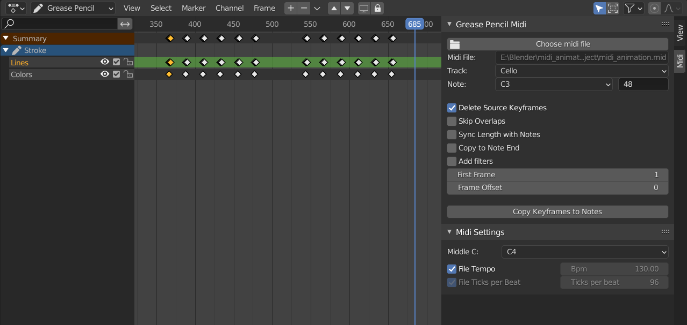

This add-on also allows for copying selected grease pencil frames to sync with notes in a midi file. The grease pencil
midi panel is available in the Grease Pencil Dope Sheet when "Only Show Selected" is selected in the Dope Sheet bar. The
grease pencil panel midi is independent of the Nonlinear Animation midi panel (the selected midi file, frame offsets,
and midi settings are not tied to the Nonlinear Animation midi panel).

For the most part, controls are the same as in the Nonlinear Animation midi panel.

* Delete Source Keyframes
    * If this option is selected, the selected keyframes will be deleting when copied.
* Skip overlaps
    * If selected, keyframes will not be copied to notes that overlap the previous note (notes where the first copied
      frame would be at or before the last copied frame of the previous note are skipped).
* Sync length with notes
    * Syncs the length of the copied keyframes to the length of the note. The spacing of the copied keyframes is
      adjusted so that the time between the first and last keyframes is equal to the length of the note multiplied by
      the scale factor.
* Copy keyframes to notes
    * Copies the selected keyframes to times that line up with instances of the selected note.

See the midi panel section for more information about the other controls.

Other Tools Panel

### Other Tools Panel

This panel contains tools that are not necessarily related to Midi. It can be hidden in the add-ons preferences.

Rename Action

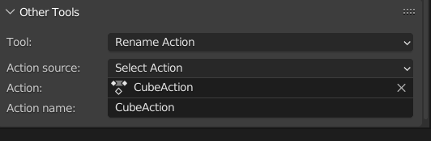

Allows for renaming an action directly from the Nonlinear Animation view.

* Action source:
  * Midi Panel
    * Rename the action selected in the NLA Midi panel.
  * Selected NLA Strip
    * Rename the selected NLA strip's action.
  * Select the action to rename.
* Action
  * The action to rename. This field is only visible if the Action source is "Select Action"
* Action name
  * The action's name. Type a name here to rename the action.

Generate transitions

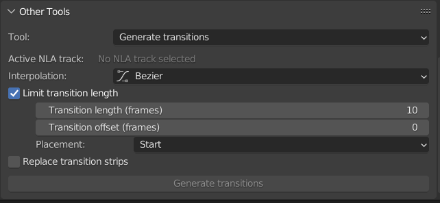

Generates NLA strips that act as transitions. 
Transitions strips are placed between selected actions on the active NLA track.

* Interpolation
    * The interpolation for the first keyframe of the transition strip's action.
* Limit transition length
    * If selected, limit the length of generated transition strips.
    * Transition Length (frames)
      * The maximum transition length to generate.
    * Transition offset
      * Transition will be offset from either previous or next strip (depending on the Placement) by up to this many frames.
    * Placement
      * Start
        * Place transitions directly after the leading action strip.
      * End
        * Place transitions immediately before the trailing action strip.
* Replace Transitions
  * If selected, replaces existing transition strips with generated transitions. Otherwise, keeps the existing transitions.

Delete transitions

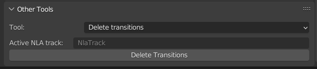

Deletes transitions between selected NLA strips on the active NLA track.

### Installation:

* Installation is the normal installation process for multi-file add-ons.
    * Option 1: [Download as a zip file](https://github.com/Cornerback24/Blender-NLA-Midi-Copier/archive/master.zip). In
      Blender, go to Edit > Preferences > Add-ons, and click Install. Select the zip file and click Install Add-on from
      File.
    * Option 2: Clone into the \<version\>/scripts/addons directory in the Blender installation.
* To enable the add-on, in Blender, go to Edit > Preferences > Add-ons, and select Animation in the drop-down. Select
  Community at the top if it isn't already selected. Check the box next to the add-on to enable it.
