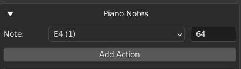
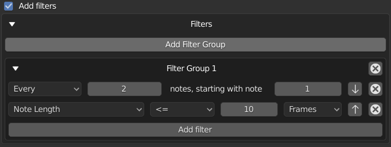

# Blender NLA Midi Copier
Blender add-on for creating midi-driven animations from the Nonlinear Animation view.  Adds a panel to the Nonlinear Animation view that allows for copying an action to each instance of a note in a midi file. For example, actions strips for a selected action could be generated to line up with all of the C4 notes played by a piano. To access the panel, expand the right-side panel in the Nonlinear Action View and select the Midi tab.

An instrument can be defined as a collection of notes and actions.  The instrument is independent of any specific midi file, allowing for defining a set of actions for each note and later syncing them up to a midi file.  To define an instrument, expand the right-side panel in the Nonlinear Action View and select the Midi Instruments tab.

This add-on is written for Blender 2.83.

Midi Panel 

 
### Midi Panel controls:

* Choose midi file:
  * Select a midi file.
* Midi File:
  * Displays the selected midi file.
* Track:
  * Choose a track from the midi file. (Tracks with no notes will not be shown.)
* Note:
  * Choose a note from the selected track. (Only notes played in the selected track will be shown.)
* Type:
  * The type of object to animate. Select "Object" to animate objects in the scene. Change this value to animate something other than an object.  For example, select "Light" to animate the brightness of a light.
* Object:
  * The object to animate.  This field will change depending on the value of Type.  If Type is Object, this field will allow selecting an object, if Type is Light, this field will allow selecting a Light, ect.  
* Action:
  * The action to generate NLA Strips from. Only actions valid for the selected Type will be shown.
* Copy Action to Selected Objects:
  * If this option is selected, then the selected objects will be animated instead of the Object in the Object control. This option is only valid for Type Object or any type that can be object data (such as Mesh and Curve). 
* Duplicate Object on Overlap:
  * If this option is selected, then overlapping action strips will be placed on new objects that are duplicates of the original object being animated. This option is only valid for Type Object or any type that can be object data (such as Mesh and Curve). If the type is not Object, then all objects using the data will be duplicated. For example if the action is defined on a Curve, all objects using the Curve will be duplicated.
* Action Length (Frames):
  * The length of the action. Used to determine if the action overlaps another action when duplicating objects. Defaults to the true length of the action. As an example, if this is set to 50 frames, and two notes are only 30 frames apart, then the action for the second note will be considered to overlap the action. The second note's action will be copied to a duplicate object if Duplicate Object on Overlap is selected. If this value is set to less than the true length of the action, it will be replaced by the true length of the action. This control is not available if no action is selected.  
* Sync Length with Notes
  * If selected, the length of the copied action will be scaled to match the length of the note it is copied to multiplied by the scale factor.
* Scale Factor
  * Affects the length of actions when "Sync Length with Notes" is selected. The copied action length will be equal to the length of the note multiplied by this scale factor. (Scale factor of 1 will match the note length exactly.)
* Copy to Note End
  * Copies the action to the end of the note instead of the beginning.
* Add filters.  
  * Adds filters. If selected, any defined filters will be applied when copying actions. No filters will be applied if this option is not selected. See the Filters section for more information about filters.
* Blending
  * Sets blending type for action strips placed on additional nla tracks if the first nla track does not have room for the action. If this is set to None, actions will be skipped if there is no room on the first nla track.     
* Nla Track:
  * The name of the NLA track to place action strips on.  If a track with this name exists, actions will be placed on it, otherwise a new track with this name will be created.  A name wil be automatically generated if this field is blank. 
* First Frame:
  * The frame that the midi file starts on.
* Frame Offset:
  * Offset in frames to use when generating action strips (can be negative). For example, if the frame offset is -5, then the generated action strips will be placed starting 5 frames before the instances of the selected note.   
* Copy Action to Notes:
  * Generates action scripts from the selected action that line up with all instances of the selected note.  

  

Midi Instrument Panel 

 
### Midi Instrument Panel Controls

* Instrument
  * The selected instrument.  

#### Properties Box

* Name
  * The name of the instrument.
* Instrument Frame Offset:
  * The frame offset used when animating the instrument. This is added to the frame offset for each action. 
* Delete \<instrument name\>  
  * Delete the instrument
      

#### Notes Box

* Note:
  * The selected note.  If there are actions associated to the note, the number of actions will be displayed in parentheses. For example, C5 (2) indicates that there are two actions associated to the note C5. An astrix indicates than there are actions that may be copied to other notes due to pitch filters. An exclamation mark indicates there are actions that are missing an object or action, so they will not be copied.
* Search
  * Search for a note by note name or midi pitch number. 
* Add Action
  * Adds an action for the selected note.    
* Action Boxes
  * Each action for the selected note is displayed in its own box. See the "Midi Panel Controls" section above for explanations of the controls in the action boxes.   

#### Transpose Box

* Transpose: The transpose buttons transpose the instrument. Transpose buttons are disabled if the transposition would result in notes outside of the 0-127 midi pitch range.
  * \- octave: shift all actions down an octave
  * \- step: shift all actions down a step
  * \+ step: shift all actions up a step
  * \+ octave: shift all actions up an octave
* Transpose filters: Sets how the pitch filters are transposed
  * Do not transpose: Does not transpose the pitch filters.
  * Transpose if possible except all-inclusive: Transposes all pitch filters except pitch filters that include every midi pitch (pitch >= 0 or pitch <= 127). Pitch filters that would be transposed to a pitch outside the 0-127 midi pitch range are not transposed.  
  * Transpose if possible: Transposes pitch filters. Pitch filters that would be transposed to a pitch outside the 0-127 midi pitch range are not transposed.  
  * Transpose all except all-inclusive: Transposes all pitch filters except pitch filters that include every midi pitch (pitch >= 0 or pitch <= 127). Transpose buttons are disabled if any pitch filters would be transposed to a range outside of the 0-127 midi pitch range. 
  * Transpose all: Transposes all pitch filters. Transpose buttons are disabled if any pitch filters would be transposed to a range outside of the 0-127 midi pitch range.

#### Animate Box

The animate instrument box is not available if there is no selected midi file.  Select a midi file in the Midi Panel.

* Track
  * The track from the midi file to use when animating the instrument.
* Copy to single track
  * If selected, all actions for the instrument will be copied to a single NLA track (this is overwritten for any actions within that define their own NLA track). If this is not selected, a new track will be created for each note.
* Nla Track:
  * The name of the NLA track to copy actions to if "Copy to single track" is selected. A name will be generated if this field is blank.    
* Animate \<instrument name\>
  * Animate the instrument.  The instrument's actions will be copied to notes from the selected track from the selected midi file.  The midi file is selected in the Midi Panel, and the selected track is selected in the Track field directly above this button.  The First Frame field in the Midi Panel will be used as the frame the midi file starts on.

* Create New Instrument
  * Creates a new instrument.
  

  

Filters

### Filters

Filters can be used to filter notes when copying actions. 
Filters are defined within a filter group. Actions are copied to notes that match any of the filter groups. For a note to match a filter group, it must match all filters within the group.
For example, if group 1 has filters A and B, and group 2 has filters C and D, actions will be copied to notes that match either both filters A and B, or both filters C and D (this includes actions matching all filters A, B, C, and D).

### Filter Controls 

Click "Add Filter Group" to add a new filter group. Click the x in the top right of the filter group to remove it.

Click "Add Filter" to add a filter within the group. Click the x next to the filter to remove it.

If more than one filter is defined in a group, the arrows can be used to move the filters up and down. The filters are applied from top to bottom.

Pitch filters overwrite instrument notes and the note selected in the midi panel.

### Filters
* Every
  * Includes every nth note starting with a specified index. For example, "Every 2 notes, starting with note 1" will include every other note, starting with the first note.
* Note Length
  * Filters notes by length. For example, "Note Length < 10 frames" will include only notes that have a length less than 10 frames.    
* Relative Start Time
  * Filters notes by their start time (time is based on the beginning of the midi file). For example, "Relative Start Time > 5 Seconds" will include only notes that start after 5 seconds into the midi file.  
* Pitch
  * Filters notes by pitch. For example, "Pitch > B3" will include all pitches above B3 (so C3 and higher). If a pitch filter is present, it will overwrite the note selected in the midi panel or in the instrument (only affects the filter group the filter is defined in). If the pitch is "Selected" it will match the selected pitch in the midi panel, or the pitch of the instrument note if the filter is part of an instrument. 
* Velocity
  * Filters notes by their midi velocity. For example, "Velocity = 127" will include only notes with a velocity of 127.     

Copy to Instrument

### Copy to Instrument

The action defined in the Nla Midi panel can be copied to an instrument.

* Instrument
  * The instrument to copy the action to.
* Note
  * The note within the instrument to copy the action to. (If the search field is blank, this field is automatically updated when the note selected in the NLA midi panel is changed.)
* Search
  * Search for a note by note name or midi pitch number.
* Copy to Instruments
  * Copies the action in the NLA midi panel to the selected instrument and note. This option is not available if "Copy Action to Selected Objects" is selected in the NLA midi panel.    
     

Midi Settings

### Midi Settings

* Middle C
  * Sets the note that corresponds to middle C (midi pitch 60). This changes the displayed value of middle C and updates the display for instrument notes and the note in the midi panel. This does not change the midi note pitches.

Grease Pencil

### Grease Pencil

This add-on also allows for copying selected grease pencil frames to sync with notes in a midi file. 
The grease pencil midi panel is available in the Grease Pencil Dope Sheet when "Only Show Selected" is selected in the Dope Sheet bar.
The grease pencil panel midi is independent of the Nonlinear Animation midi panel (the selected midi file, frame offsets, and midi settings are not tied to the Nonlinear Animation midi panel). Instruments are not supported for grease pencil keyframes.

For the most part, controls are the same as in the Nonlinear Animation midi panel. 

* Delete Source Keyframes
  * If this option is selected, the selected keyframes will be deleting when copied.
* Skip overlaps
  * If selected, keyframes will not be copied to notes that overlap the previous note (notes where the first copied frame would be at or before the last copied frame of the previous note are skipped).
* Sync length with notes
  * Syncs the length of the copied keyframes to the length of the note. The spacing of the copied keyframes is adjusted so that the time between the first and last keyframes is equal to the length of the note multiplied by the scale factor.
* Copy keyframes to notes
  * Copies the selected keyframes to times that line up with instances of the selected note.
  
See the midi panel section for more information about the other controls.
  

### Installation:
* Installation is the normal installation process for multi-file add-ons.
  * Option 1: [Download as a zip file](https://github.com/Cornerback24/Blender-NLA-Midi-Copier/archive/master.zip). In Blender, go to Edit > Preferences > Add-ons, and click Install.  Select the zip file and click Install Add-on from File.
  * Option 2: Clone into the 2.83/scripts/addons directory in the Blender installation.
* To enable the add-on, in Blender, go to Edit > Preferences > Add-ons, and select Animation in the drop-down. Select Community at the top if it isn't already selected. Check the box next to the add-on to enable it.
